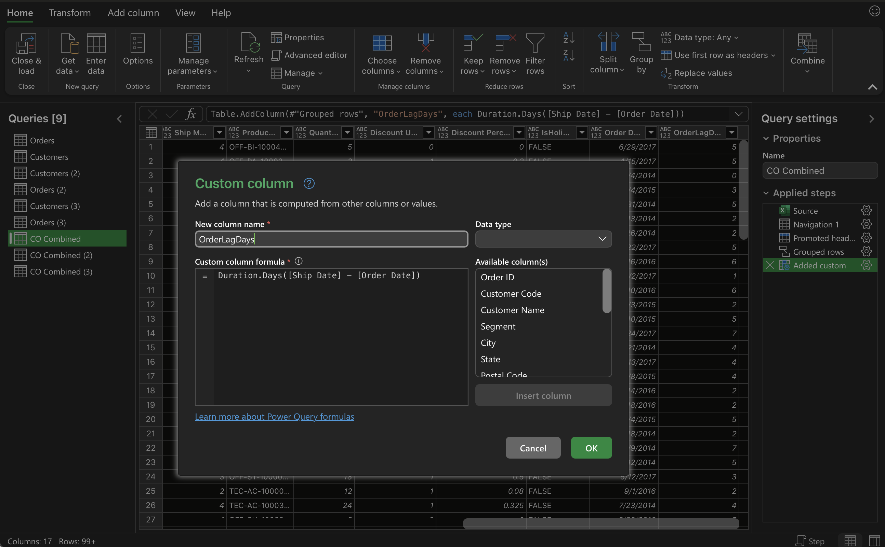
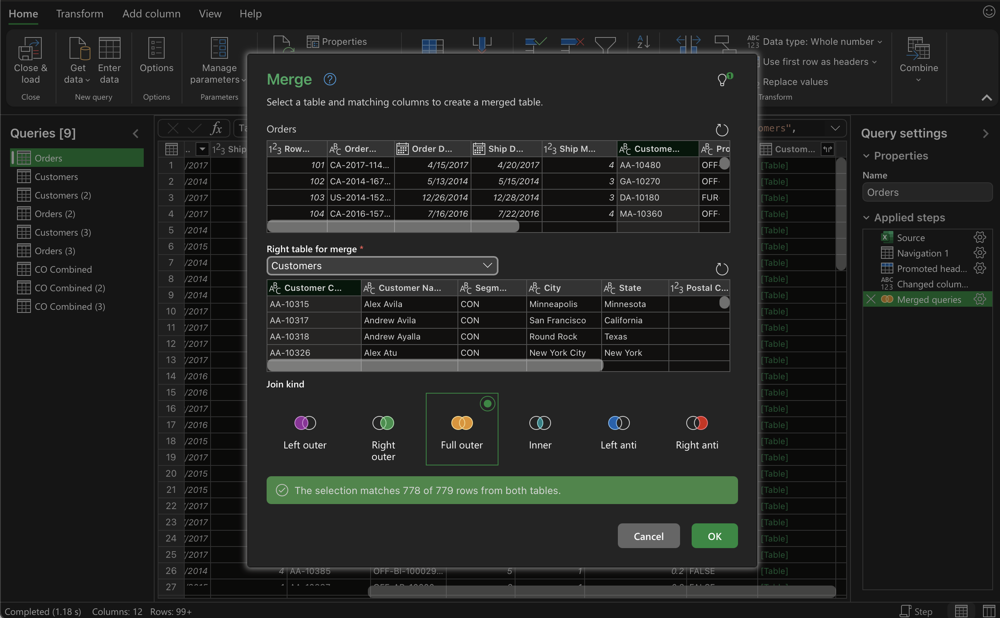
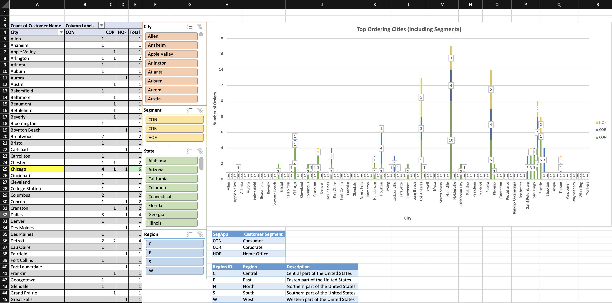
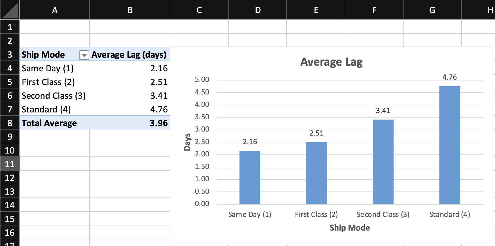

# Superstore Analytics Project
## 📌 Project Overview

This is a self-directed Excel analytics project analyzing customer and order data from the `Superstore Dataset` using Excel, Power Query, and the regression modeling technique. I independently defined the project objectives, designed the analytical workflow, engineered new features, and applied regression analysis to explore factors influencing order fulfillment performance.

The project demonstrates skills in:
- Data cleaning & integration
- Feature engineering
- Regression analysis
- Shipping performance evaluation
- Dashboard planning

### 🧩 Problem Framing & Project Motivation
Identify operationally relevant questions that could be answered using customer and order data.

I asked:
- How can customer and order data be combined to support operational analysis?
- What measurable variable can capture order fulfillment efficiency?
- Which customer or order characteristics may be associated with shipping delays?

These questions guided the data preparation, feature engineering, modeling, and dashboard design decisions throughout the project.

### 🧠 **Key Objectives**
- Combine customer and order data into a unified analytical dataset
- Use regression analysis to examine relationships between variables
- Engineer a new variable measuring fulfillment speed
- Build a dashboard to communicate insights clearly
### 🗂️ **Data Sources**
The project uses two primary tables from the Superstore Dataset:
- Customers: customer demographics and segment information
- Orders: order details including order date and ship date

Excel File: [Superstore Dataset](superstore_dataset.xlsx)

Alternatively, the Excel file can be accessed within this repository above `superstore_dataset.xlsx`

---

### 🔧 Data Preparation & Transformation

1. Data Integration (Power Query)
- Used Excel Power Query to merge the Customers and Orders tables
- Synchronized the tables using a shared key
- Created a consolidated table named `CO Combined`

2. Feature Engineering
- Duplicated the combined table into CO Combined Revised
- Created a new calculated field:
  - **OrderLagDays** = number of days between **Order Date** and **Ship Date**

This variable captures **order fulfillment delay**, an important operational performance metric

## 📈 Regression Analysis
To formally evaluate drivers of order fulfillment delay, I constructed a multiple linear regression model with **OrderLagDays** as the dependent variable.

Categorical variables (including shipping mode, customer segment, and region) were converted into **dummy variables** to allow for structured comparison across categories while holding other factors constant. The regression was run using Excel’s Analysis ToolPak, and model outputs were evaluated based on coefficient direction, statistical significance (p-values), and overall model fit.

This modeling approach enabled simultaneous control across customer, geographic, and order-level attributes, allowing the analysis to isolate which factors were meaningfully associated with fulfillment delay.

## 💡 Key Insights
- **Shipping mode is the primary variable associated with fulfillment delay** in this model. Same Day, First Class, and Second Class shipping options are all statistically significant and are associated with fewer **OrderLagDays** relative to the baseline shipping method (Standard Class).
- **Customer segment variables** (Consumer, Corporate, Home Office) are not statistically significant, suggesting that customer type does not meaningfully explain variation in fulfillment speed once shipping method is accounted for.
- **Geographic variables** (East, West, South) are also not statistically significant, indicating that regional differences do not appear to drive fulfillment delays in this dataset.
- **Order-level characteristics**, including quantity, discount usage, and holiday timing, do not show significant relationships with fulfillment delay when controlling for shipping method.
- Overall, the results suggest that **fulfillment performance is driven more by operational decisions (shipping method) than by customer demographics or order attributes**.

These findings are exploratory and highlight shipping method as the most relevant operational lever for further analysis and visualization.

---

## 📦 Shipping Mode Analysis
Regression results indicate that **shipping mode is the only statistically significant factor** associated with variation in order fulfillment delay (**OrderLagDays**) in this model.

Using Standard Class as the baseline category, all expedited shipping options show significantly shorter fulfillment times:
- **Same Day** shipping is associated with an average reduction of approximately **2.63 days**
- **First Class** shipping reduces fulfillment time by approximately **2.27 days**
- **Second Class** shipping reduces fulfillment time by approximately **1.38 days**

These findings are consistent with the descriptive analysis of the data. Average order lag decreases monotonically as shipping speed increases, with Standard Class exhibiting the highest average lag and Same Day the lowest.

Together, the regression and summary statistics suggest that **fulfillment performance in this dataset is driven primarily by operational shipping choices rather than customer demographics, geography, or order attributes**.

---

## 📊 Dashboard & Visualization
An Excel dashboard was created to support exploratory analysis and visually reinforce findings from the regression model.

### Top Ordering Cities (Including Segments)

A stacked bar chart displays the number of orders by city, segmented by customer type (Consumer, Corporate, Home Office). This visualization highlights:
- Cities with the highest order volume (e.g., Los Angeles, New York City, Philadelphia)
- The distribution of customer segments within high-volume cities
- How order activity is concentrated geographically while customer mix remains relatively balanced

This chart provides business context around where orders originate, while supporting the regression finding that customer segment itself is not a primary driver of fulfillment delay.

### Average Fulfillment Lag by Shipping Mode

A bar chart compares the average **OrderLagDays** across shipping methods. The visualization shows a clear monotonic pattern:
- **Same Day** has the lowest average lag (~2.16 days)
- **First Class** and **Second Class** show progressively higher lag
- **Standard Class** has the highest average lag (~4.76 days)

These descriptive statistics closely align with the regression results, reinforcing that **shipping mode is the most influential factor associated with fulfillment speed** in the dataset.

Together, the dashboard complements the statistical analysis by pairing regression findings with an intuitive visual.

---

## 🛠 Tools Used

- **Microsoft Excel**
  - Power Query for data integration and transformation
  - Pivot Tables for exploratory analysis (**Average Lag**)
  - Regression Analysis ToolPak for statistical modeling
  - Calculated fields and dummy variables to set up the regression model
  - Dashboards and charts for data visualization
- **Analytical Techniques**
  - Data cleaning and table synchronization
  - Feature engineering (OrderLagDays)
  - Multiple linear regression
  - Descriptive statistics and visual validation

---

## 🧾 Summary
This project demonstrates an end-to-end, self-directed analytical workflow using Excel. Starting with raw customer and order data, I integrated multiple tables, engineered an operational performance metric, and applied regression analysis to explore drivers of order fulfillment delay.

The analysis identified **shipping mode** as the primary factor associated with fulfillment speed, a finding that was reinforced through descriptive statistics and dashboard visualizations. Customer demographics, geographic variables, and order-level characteristics were not statistically significant once shipping method was accounted for.

Overall, this project highlights my ability to independently frame analytical questions, apply appropriate statistical techniques and communicate them through both models and visuals in a business-relevant context.

---
